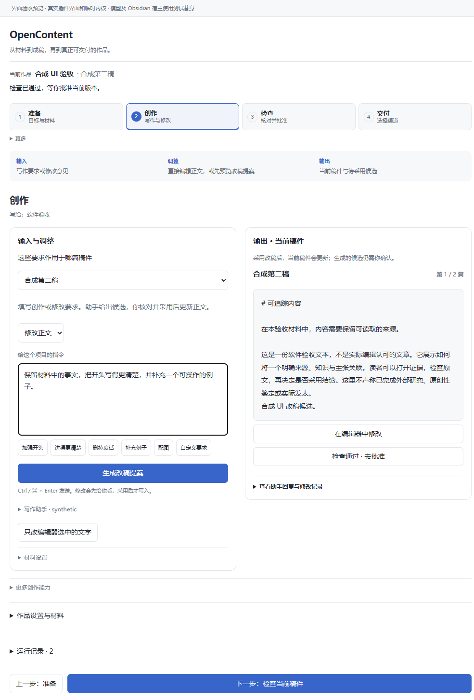

# OpenContent 界面改造与安装记录

本轮依据用户提供的 WeSight 截图改造 OpenContent，并按用户授权替换到正式 Vault。目标是在保留原有功能与确认规则的前提下，让开始、输入、调整、输出和结束清楚可见。正式插件及配套内核已安装为 0.8.2，原生 Obsidian 的重新加载和实际使用体验仍待确认。

## 使用路径

主流程为「准备 → 创作 → 检查 → 交付」。顶部显示当前作品、稿件、状态和所在步骤；每步说明输入、调整与输出，底部给出明确的上一步和下一步。

| 步骤 | 输入位置 | 调整位置 | 输出位置 |
| --- | --- | --- | --- |
| 准备 | 首屏写作想法与目标 | 目标、读者与材料设置 | 作品及后续创作入口 |
| 创作 | 输入与调整区的创作或改稿要求 | 快捷要求、写作助手、材料设置及正文编辑器 | 当前稿件与待采用候选 |
| 检查 | 当前稿件及核对意见 | 检查问题与批准当前版本 | 检查结果和批准状态 |
| 交付 | 渠道与格式选择 | 各渠道原有设置 | 文件位置或渠道操作结果 |

窄屏依次显示输入区与输出区。切换目标稿件只有一个明确入口；常用输入优先出现，辅助设置与历史收起，待采用候选自动展开。按钮使用「生成改稿提案」「生成配图」「停止生成」等实际动作名称。采用候选、批准版本和发布保持为独立操作；本地导出不表示已经发表。

[查看窄屏创作页](ux-research/opencontent-ui-clarity-narrow.png)

## 从 WeSight 学到并落实的关键点

编号步骤对应明确的开始与结束；编辑、设置、预览各有位置；按钮直接说明动作；底部始终提供下一步。本轮进一步区分当前稿件和待采用候选，避免失效的检查状态被显示为全部通过，并让本地导出结果持续可见。长提案遮挡采纳按钮的问题已修复。是否比 WeSight 更好用，以实际使用体验为准。

## 安装与兼容修复

已替换正式 Vault 中的插件，界面和内核版本均为 0.8.2。安装前保存了原插件、配置、作品与数据库的可回退备份，旧内核目录保留。

实际安装核对发现开发版遗漏了正式 0.8.1 的两个兼容行为：独立 Market 和 Deconstruction 报告应由能力模块读取，不进入普通稿件解析；机制卡片库需要保留 GET 查询。曾安装的未修复版本让三份既有市场报告污染核心诊断，已立即回退。修复复用了正式插件的目录规则并恢复 GET 查询，同时保留 POST 接口及路径检查。没有删除报告、放宽核心对象格式或批准稿件来消除问题。

修复后再次安装并核对：全部安装载荷与源码逐文件匹配；61 份作品及关联文件保持不变；模型、材料目录、主题、工作模式和当前作品等原有设置保持不变；89 份旧内核文件仍匹配备份。正式库仍有两个作品和一项待处理稿件，诊断为空。原先检查通过且未批准的稿件仍为检查通过、未批准。

## 本轮验证

| 检查 | 结果与边界 |
| --- | --- |
| Node 界面及引擎回归 | 53 项通过 |
| 安装包浏览器流程 | 16 项通过，使用实际安装的插件和内核、临时合成 Vault |
| 报告与机制卡片 HTTP 流程 | 源码及安装内核均 15 项通过；修复前失败证据保留；损坏普通对象仍被诊断；GET 与 POST 均拒绝库外联接卡片 |
| 完整 Python 回归 | 269 次执行，266 次通过，三项既有 Windows 符号链接权限失败；完整套件仍未通过 |
| 安装前后环境检查 | 通过；界面和内核版本一致；不表示模型登录已实测 |
| lint 与兼容检查 | 零错误，一项原有设置搜索兼容提示；负例检查通过 |
| 构建及长提案检查 | 构建通过；320、440、1000 像素宽度下长提案无重叠 |

三项完整套件失败为 `test_output_path_rejects_internal_symlinks_and_windows_forms`、`test_import_rejects_symlink_hardlink_and_nonregular_file` 和 `test_linked_images_and_lexical_ancestor_links_fail`，均在制造 Windows 符号链接对象时遇到 WinError 1314。本轮未跳过测试、放宽断言或修改系统权限。

浏览器与 HTTP 流程的模型、账号及宿主行为均为明确的测试替身；测试数据不会写入正式作品。没有执行真实模型生成或平台发表。独立复核结果及机器可读摘要见本目录的 `UI-CLARITY-RESULTS.json`；详细原始证据留在本机 `.execution/deploy-ui-20261004`。

## 复现与使用

使用 Python 3.12 或更高版本和仓库固定依赖，可运行 `npm test`、`python -B -m unittest discover -s tests -v` 与 `python -B scripts/verify_capability_assets.py --runtime . --output .execution/capability-assets.json`。启动 `tests/helpers/ui_clarity_preview.py` 后，以其输出地址运行 `tests/ui-clarity-journey.playwright.js` 中的浏览器流程。预览默认使用仓库插件；可通过 `OPENCONTENT_PREVIEW_PLUGIN_DIR` 和 `OPENCONTENT_PREVIEW_RUNTIME` 指向实际安装文件进行隔离验证。

安装文件已经替换。请在保存当前编辑内容后，重新加载 OpenContent 或重启 Obsidian，使正在运行的旧插件切换到新版本。此会话无法确认原生宿主已经重新加载，不将安装包的浏览器检查当作原生验收。本轮更新仓库源代码与现有 PR，不发布或覆盖同版本的 GitHub Release。
