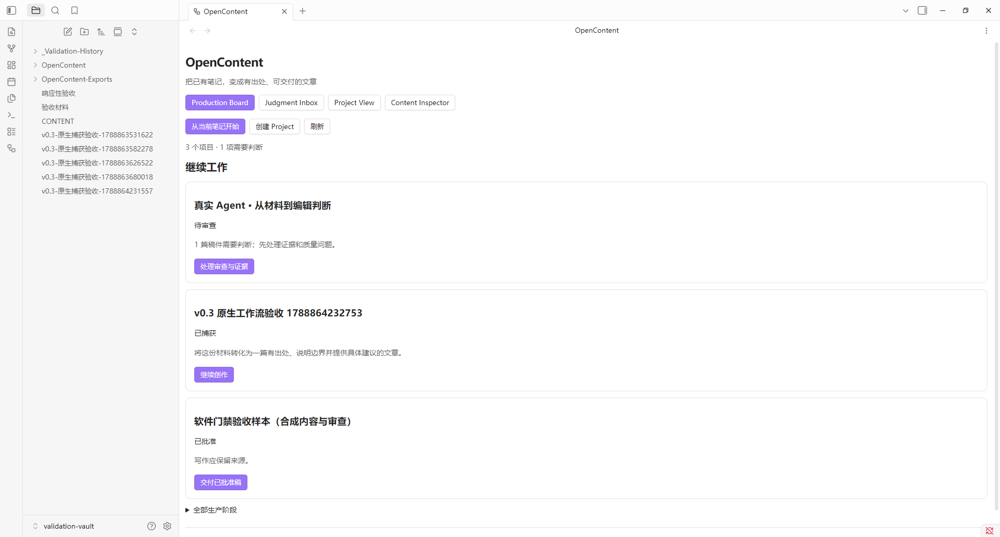

# OpenContent 0.3：市场改进与验证记录

日期：2026-09-08。状态：**本次实现与本地工程验收通过；市场留存、社区上架和 Ailu 远程发表未验证。** 当前目录不是 Git 仓库，回退依据为源码 ZIP 快照与安装脚本备份，不声称存在已提交的 Git commit。

## 可复验结果

| 项目 | 结果 | 证据 |
|---|---|---|
| JavaScript 语法、Python 编译、30 个自动化用例 | PASS | [verification.json](verification.json)，最终执行时间 10:44:43 UTC，含命令输出与源码哈希 |
| 真实 Obsidian 1.13.7 中的 17 项交互检查 | PASS | [obsidian-workflow-v0.3.json](obsidian-workflow-v0.3.json)，完成于 10:46:14 UTC，安装文件与源码哈希一致 |
| 原生笔记/选区入口 | PASS | 命令面板执行 editorCallback，实际选区写入 Material；其他段落/私有属性未进入；来源笔记保持原文 |
| 去重、继续、预览失效 | PASS | 实际点击保存两次仅一份材料；重启插件恢复上次项目；预览后修改材料返回冲突，Job 数未增加 |
| 已批准 Markdown 交接 | PASS（合成样本） | 点击 Inspector 按钮，打开普通 Markdown；项目仍 APPROVED，没有远程调用 |
| 真实文章的最终批准 | 未代用户执行 | 《让知识与内容有据可查》仍待人工判断，Inspector 没有交接按钮 |
| 空闲请求与内容事件 | PASS（有限窗口） | 请求 6,500 ms 观察窗内 Board 请求为 0，修改测试材料后刷新恢复；宿主 renderer 为 hidden，可能节流，**不是前台性能基准** |
| 打包校验 | 见 dist/SHA256.json | ZIP CRC 与白名单检查；三文件插件包；源码包排除验收 Vault、运行日志和 Ailu 研究代码 |

运行 `python scripts/verify.py` 重现当前自动测试。真实宿主验证脚本为 `scripts/verify_obsidian_workflow.js` 与 `scripts/verify_obsidian_handoff.js`，通过 `scripts/obsidian_cdp.mjs` 仅连接明确启动的独立 Obsidian 调试实例（loopback 9337）。不要对用户日常 Vault 运行这些验收脚本。

新增自动化覆盖：同内容去重、修改后新快照、不同项目隔离、坏 URL/过期 token、仅当前人工批准可交接、导出不发布/幂等/拒绝覆盖后续编辑、源资料/规则变化拦截、导出准备期间再次检查、缓存不被返回对象修改污染、相同大小与 mtime 的修改仍被发现、预览过期或排队期间编辑时不调用 Provider、真实 HTTP 路由。原有失败恢复、取消、进程树、门禁与数据所有权测试继续执行。

## 发现与修复

真实宿主第一次测试关闭弹窗时使用了旧选择器，观察实际 DOM 后改为当前 `.modal-header-button`；这是验收脚本修正。随后出现保存后异步切换与后台刷新重叠，增加渲染合并，同时让验收等待可操作按钮出现。完整脚本在最终源码上重新通过，未以单元测试替代宿主交互。

早期 UI 测试产生的临时 Project/Material 已移到独立验收 Vault 的 `_Validation-History/v0.3/`，保留内容；源笔记仍在。活动列表保留真实待判断项目、合成批准样本和最终捕获样本。迁移清单保存在工作区 `docs/ui-fixture-archive.json`。没有触碰用户的 `F:\Obsidian_vault`。

## 没有声称完成的事项

- 0.2 曾实际调用 Codex 完成四阶段任务，原收据见 [此前验收](VALIDATION.md)。0.3 对新增路径进行真实宿主验证，未为本轮重新跑模型全文生成；因此不把旧模型收据标记成新版生成效果实测。
- Ailu 仅做官方资料与固定提交源码审阅，未安装运行或验证实际平台导入、排版、发布。Markdown 交接不是官方集成或发表凭证。
- 没有真实参与者、留存数据、收费验证、社区提交、移动端/macOS/Linux 实机验证或大型 Vault 性能结论。manifest 最低版本 1.8.0 为现有声明，本轮实际宿主是 1.13.7；正式分发前仍需补最低版本测试或提高声明。
- 空闲优化不移除写入与批准前的完整校验。当前 token 覆盖整个领域目录与政策，其他项目变化也可能造成保守的冲突；没有用缓存跳过字节核验。
- 交接移除 URL 查询参数/片段，某些来源地址可能需补正；本地材料没有公开 URL 时脚注明确说明。URL 路径及正文的敏感信息不会被智能识别。
- 自动捕获的是快照，原笔记后来修改不会自动改写 Material。来源更新检测与跨项目受影响稿件列表属于后续计划。

## 交付自评

按 agent-self-evaluation 五轴自查；这是维护者自评，不是用户满意度。

| 维度 | 评分 | 依据与下一步 |
|---|---|---|
| 准确性 | 4/5 | 官方来源、固定提交、真实测试可追溯；竞品未做运行实测 |
| 完整性 | 4/5 | 竞争判断、已实施工作流、试点和回退齐全；真实留存需四周试点 |
| 清晰度 | 4/5 | 报告区分事实、推断与计划；插件仍保留部分英文领域词 |
| 可执行性 | 4/5 | 可安装版本、配置入口与验证脚本；Python 依赖仍是主要阻力 |
| 简洁性 | 4/5 | 日常入口收敛，完整证据独立存档；设置与报告仍偏技术读者 |

平均 4.0/5。最高优先级的改进是观察真实安装失败和审查净收益，再决定运行时打包与来源更新功能。用户是否认可，应以试点中的自主复用与返工记录衡量。
